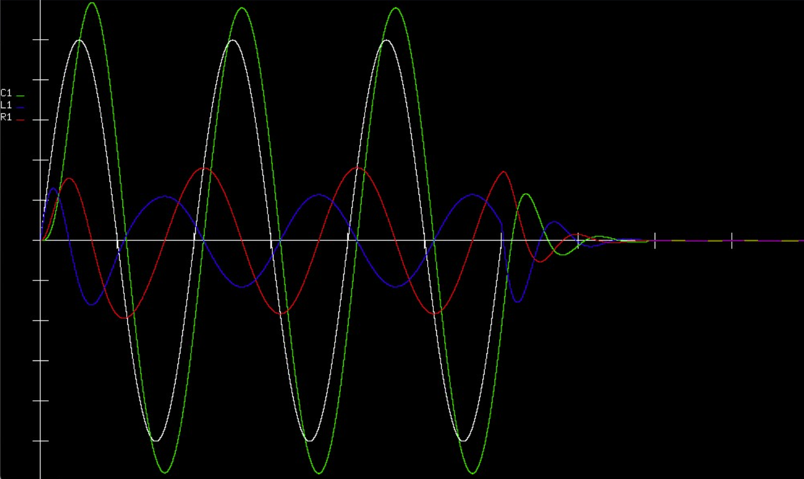

# Analog Circuit Simulator

A visually interactive **Analog Circuit Simulator** built using **C++** and the **OpenGL library**, designed to simulate the behavior of RLC circuits in real-time. This project demonstrates the application of numerical methods to predict circuit behavior and provides a graphical visualization of voltage variations across components.



## Features

- Simulates and visualizes voltage across resistors, capacitors, and inductors in an RLC circuit.
- Uses **Euler's Method** to approximate differential equations governing circuit components.
- Implements a cost function to iteratively predict currents with minimal error.
- Dynamic, color-coded visualizations for each circuit component using **OpenGL**.

## Technologies Used

- **Programming Language**: C++  
- **Graphics Library**: OpenGL  
- **Development Environment**: Microsoft Visual Studio  

## How It Works

1. **Circuit Components**:  
   The project simulates an RLC circuit using the following equations:
   - Resistor Voltage: \( V_R(t) = i \times R \)
   - Inductor Voltage: \( V_L(t) = L \frac{\Delta i}{\Delta t} \)
   - Capacitor Voltage: \( V_C(t) = V_0 + \frac{1}{C} \int i \, dt \)

2. **Numerical Methods**:  
   **Euler's Method** is employed to approximate the above equations with small time steps.

3. **Cost Function**:  
   A heuristic algorithm predicts currents by minimizing the difference between the applied voltage and the sum of the component voltages.

4. **Graphics Integration**:  
   Visualizes the sinusoidal voltage applied across the circuit and individual component voltages in distinct colors.

## Setup

To set up and run the Analog Circuit Simulator, follow these steps:

### Prerequisites

- A C++ compiler (e.g., Visual Studio 2017 or later)
- OpenGL library

### Steps to Set Up

1. **Clone the Repository**  
   Clone the project repository from GitHub:
   ```bash
   git clone https://github.com/masuma131/Analog-Circuit-Simulator.git
    ```
2. **Open the Project in Visual Studio**
Open the .sln file provided in the repository using Microsoft Visual Studio.

Install OpenGL Dependencies

Right-click on "References" in the Solution Explorer and select Manage NuGet Packages.
Open the Package Manager Console tab at the bottom of Visual Studio.
In the prompt, type the following command and press Enter:
```bash
Install-Package nupengl.core
```

3. **Build the Project**
Press Ctrl + Shift + B or select Build Solution from the menu to compile the project.

4. **Run the Project**
Press F5 or click the Start button in Visual Studio to run the Analog Circuit Simulator.

## Additional Resources
For detailed instructions on setting up OpenGL in Visual Studio, refer to this [tutorial](https://content.byui.edu/file/2315e65e-a34a-48d3-814d-4175a2b74ed5/1/intro/165-opengl-visualStudio2017.html).

